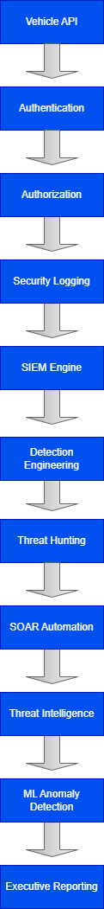

# Secure Vehicle API: Zero Trust + Behavioral Detection Simulation

## Overview

This project is a multi-phase cybersecurity simulation demonstrating how weak identity validation, broken access control, and limited observability can create cyber-physical risk in connected vehicle systems.

The project progressively evolves from a deliberately vulnerable API into a Zero Trust-oriented architecture with SIEM/UEBA-style behavioral detection, detection engineering, threat hunting, incident response automation, and threat intelligence correlation.

---

## Architecture Diagram



---

# Project Phases

## Phase 1 — Vulnerable Baseline

* Flask API with unrestricted access
* Endpoints:

  * `/status`
  * `/unlock`
  * `/start`
* Access controlled only by vehicle identifiers
* No authentication
* No authorization
* No rate limiting

### Security Weaknesses Demonstrated

* Broken access control
* Predictable identifiers
* Unauthenticated API access
* Lack of observability

---

## Phase 2 — Authentication + Rate Limiting

* Added API key authentication
* Added request rate limiting
* Added structured security logging
* Added security response headers

### Security Concepts

* Identity validation
* API hardening
* Abuse prevention
* Request attribution

---

## Phase 3 — Authorization + Least Privilege

* Added entitlement enforcement
* Mapped identities to authorized vehicles
* Blocked unauthorized cross-vehicle access
* Added authorization-aware logging

### Security Concepts

* Authentication vs authorization
* Least privilege
* Entitlement enforcement
* Zero Trust architecture

---

## Phase 4 — SIEM / UEBA-Style Detection

* Added live SIEM-style polling engine
* Added weighted risk scoring
* Added cumulative identity risk tracking
* Added alert classification
* Added behavioral anomaly detection
* Added live SIEM snapshots
* Added alert suppression cooldown logic

### Detection Concepts

* Behavioral analytics
* Identity-centric monitoring
* Security event correlation
* Risk aggregation
* SIEM/UEBA-style observability

### Sample Security Events

* Unauthorized vehicle access attempts
* Invalid API key detection
* Missing API key detection
* Identity-centric behavioral monitoring
* Risk-scored SIEM alerts

### Generated Security Visualizations

See `/screenshots` for:

* Request distribution charts
* Vehicle access activity
* Security failure analytics

---

## Phase 5 — Detection Engineering + MITRE ATT&CK Correlation

* Added detection engineering workflows
* Added MITRE ATT&CK tactic mapping
* Added event correlation logic
* Added severity-based alert prioritization
* Added structured detection analytics

### Detection Engineering Concepts

* MITRE ATT&CK framework mapping
* Detection logic engineering
* Threat classification
* Alert prioritization
* Correlation analytics

---

## Phase 6 — Threat Hunting

* Added proactive threat hunting workflows
* Added suspicious identity analysis
* Added anomalous behavioral pattern discovery
* Added historical event analysis
* Added IOC-style hunting logic

### Threat Hunting Concepts

* Proactive security analysis
* IOC discovery
* Behavioral hunting
* Threat pattern analysis
* Adversary detection workflows

---

## Phase 7 — SOC Incident Response Automation

* Added automated incident response workflows
* Added alert triage workflows
* Added incident severity scoring
* Added automated containment recommendations
* Added incident response reporting

### Incident Response Concepts

* SOC workflows
* Alert triage
* Incident classification
* Response orchestration
* Security operations automation

---

## Phase 8 — Threat Intelligence Correlations

* Added threat intelligence correlation engine
* Added IOC matching workflows
* Added suspicious IP reputation analysis
* Added threat feed enrichment logic
* Added behavioral-to-threat correlation
* Added intelligence-based severity scoring

### Threat Intelligence Concepts

* Threat intelligence integration
* IOC correlation
* Threat enrichment
* Intelligence-driven detection
* Adversary infrastructure analysis
* Security event correlation

---

## Phase 9 — SOAR Automation + Automated Containment

* Added SOAR-style automation workflows

* Added automated containment engine

* Added automated response playbooks

* Added identity quarantine simulation

* Added automated API key disablement

* Added containment event reporting

### SOAR Concepts

- Security orchestration
- Automated response
- Playbook execution
- Identity containment
- Automated remediation
- Security operations automation

--- 

## Phase 10 — SOC Dashboarding

* Added Splunk-style dashboard visualizations
* Added SOC activity monitoring
* Added endpoint activity analytics
* Added security event aggregation
* Added operational dashboard reporting
* Added visualization-driven SOC monitoring

### Dashboarding Concepts

* SIEM dashboard design
* Security data visualization
* SOC operational monitoring
* Alert trend analysis
* Security telemetry analytics
* Analyst workflow visibility

---

## Phase 11 — Machine Learning Anomaly Detection

* Added Isolation Forest anomaly detection
* Added behavioral anomaly scoring
* Added suspicious event classification
* Added machine learning-based event analysis
* Added anomaly confidence scoring
* Added behavioral deviation detection

### Machine Learning Security Concepts

* Behavioral baselining
* Unsupervised anomaly detection
* Outlier analysis
* Security-focused machine learning
* Statistical anomaly scoring
* Adversarial behavior detection

---

## Phase 12 — Cloud Security Simulation

* Added simulated cloud IAM security events
* Added cloud audit monitoring
* Added cloud identity risk scenarios
* Added simulated cloud privilege escalation events
* Added cloud administrative abuse detection
* Added cloud control plane monitoring

### Cloud Security Concepts

* Cloud IAM security
* Cloud audit logging
* Identity-centric cloud monitoring
* Cloud privilege abuse
* Cloud attack surface analysis
* Cloud security observability

---

## Phase 13 — Identity Attack Path Analysis

* Added attack chain simulation
* Added identity relationship analysis
* Added privilege escalation path modeling
* Added lateral movement simulation
* Added trust relationship analysis
* Added identity attack graph workflows

### Identity Security Concepts

* Identity attack path analysis
* Privilege escalation modeling
* Lateral movement analysis
* Identity trust relationships
* Adversary path simulation
* Identity-centric security analytics

---

## Phase 14 — ATT&CK Heatmap Visualization

* Added MITRE ATT&CK coverage mapping
* Added heatmap-style analytics
* Added technique coverage scoring
* Added ATT&CK tactic visualization
* Added detection coverage analysis
* Added ATT&CK-based reporting

### ATT&CK Visualization Concepts

* ATT&CK framework analysis
* Threat coverage visualization
* Detection maturity analysis
* Tactic and technique correlation
* ATT&CK heatmap generation
* Detection coverage analytics

---

## Phase 15 — Executive Reporting

* Added executive security reporting
* Added SOC KPI reporting
* Added incident trend reporting
* Added security posture analytics
* Added executive-level operational summaries
* Added strategic cybersecurity metrics

### Executive Reporting Concepts

* SOC metrics reporting
* Security KPI analysis
* Executive cybersecurity communication
* Incident trend analysis
* Security posture measurement
* Operational risk reporting
 
---

# Screenshots

Security monitoring and analytics visualizations are available in the `/screenshots` directory, including:

- SIEM-style alert dashboards
- Request activity distributions
- Security failure analytics
- Threat detection visualizations
- Behavioral anomaly charts
- Risk scoring analytics
- Threat hunting activity
- Incident response workflows
- Threat intelligence correlation dashboards

## Advanced Security Analytics Screenshots

### Phase 10 — SOC Dashboarding
- SOC operational dashboards
- Security event visualizations
- Endpoint activity monitoring

### Phase 11 — ML Anomaly Detection
- Isolation Forest anomaly scoring
- Behavioral anomaly analytics
- Outlier detection visualizations

### Phase 12 — Cloud Security
- IAM security monitoring
- Cloud privilege escalation alerts
- Cloud audit event analytics

### Phase 13 — Attack Path Analysis
- Identity attack chain visualization
- Privilege escalation path mapping
- Lateral movement analysis

### Phase 14 — ATT&CK Heatmaps
- ATT&CK tactic coverage
- Detection heatmaps
- Technique correlation analytics

### Phase 15 — Executive Reporting
- SOC KPI summaries
- Executive security metrics
- Operational risk reporting

---

# Visualization Layer

## visualizations.py

Original visualization implementation.

## visualizations_v2.py

Updated visualization implementation with PNG export support.

---

# Technologies Used

* Python
* Flask
* requests
* pandas
* matplotlib

---

# Security Concepts Demonstrated

* Zero Trust Architecture
* Authentication
* Authorization
* Least Privilege
* SIEM Monitoring
* UEBA-style Detection
* Detection Engineering
* MITRE ATT&CK Mapping
* Threat Hunting
* Incident Response Automation
* Threat Intelligence Correlation
* Risk Scoring
* Behavioral Analytics
* Security Event Correlation

---

# Repository Structure

```text
phase1_vulnerable_api.py
phase2_authenticated_api.py
phase3_authorization_api.py
phase4_siem_detection.py
phase5_detection_engineering.py
phase6_threat_hunting.py
phase7_incident_response.py
phase8_threat_intelligence_correlations.py

visualizations.py
visualizations_v2.py
analyze_logs.py
```

---

# How To Run

## Install Dependencies

```bash
pip install -r requirements.txt
```

---

## Run Individual Phases

### Phase 1

```bash
python phase1_vulnerable_api.py
```

### Phase 2

```bash
python phase2_authenticated_api.py
```

### Phase 3

```bash
python phase3_authorization_api.py
```

### Phase 4

```bash
python phase4_siem_detection.py
```

### Phase 5

```bash
python phase5_detection_engineering.py
```

### Phase 6

```bash
python phase6_threat_hunting.py
```

### Phase 7

```bash
python phase7_incident_response.py
```

### Phase 8

```bash
python phase8_threat_intelligence_correlations.py
```

---

# About

Zero Trust Vehicle API Security Project with Authentication, Authorization, SIEM Monitoring, Detection Engineering, Threat Hunting, Incident Response Automation, and Threat Intelligence Correlation.
