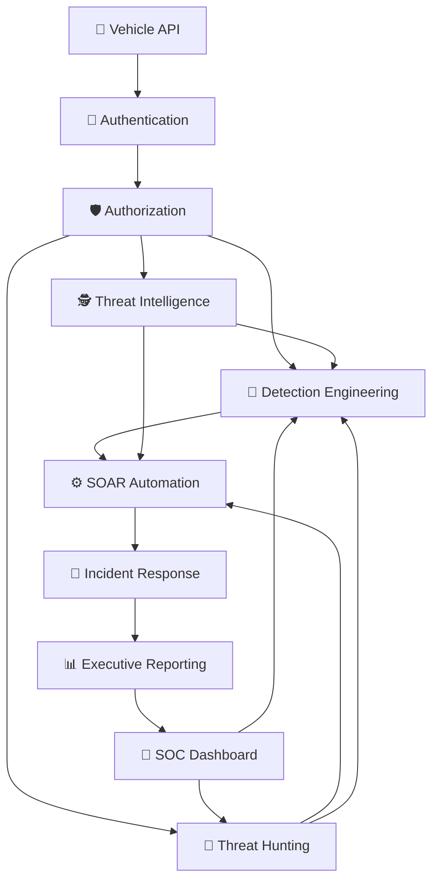
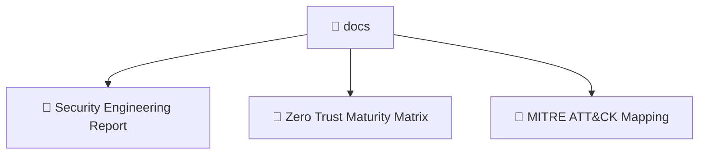
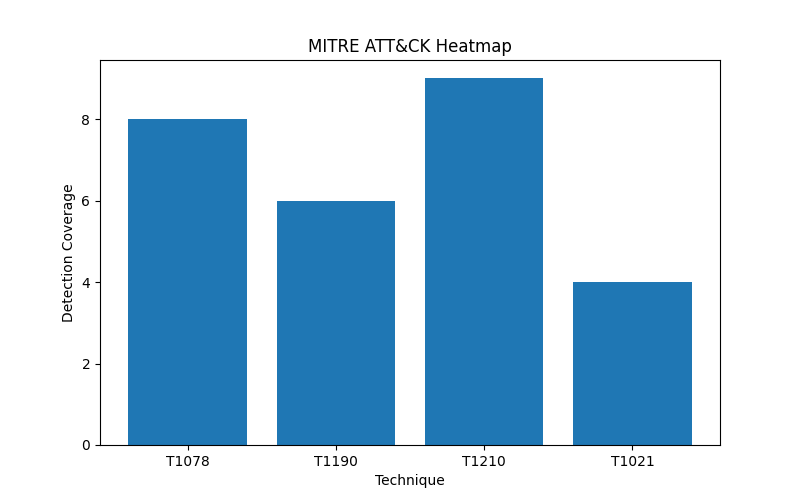

# 🚗 Secure Vehicle API: Zero Trust Security Operations Platform


---

## Executive Summary

Secure Vehicle API: Zero Trust Security Operations Platform is a cybersecurity engineering project that demonstrates the evolution of a vulnerable vehicle control API into a Zero Trust–aligned Security Operations ecosystem.

The project progresses through twenty security phases that collectively demonstrate the implementation of Zero Trust Architecture through Detection Engineering, Threat Hunting, Incident Response, Threat Intelligence, SOAR Automation, Identity Security, Cloud Security, Kubernetes Security, Endpoint Detection and Response (EDR), Purple Team Operations, and AI-assisted SOC workflows.

Using a vehicle API as the attack surface, the platform demonstrates how modern security teams implement layered defensive controls, continuous monitoring, threat detection, automated response, and security analytics across an evolving enterprise environment.

This repository serves as a cybersecurity engineering and SOC simulation platform for demonstrating modern defensive security operations, security architecture, and Zero Trust principles rather than a production vehicle control system.

---

## Architecture


---

## Documentation

| Document                    | Link                                               |
| --------------------------- | -------------------------------------------------- |
| Security Engineering Report | [View Report](docs/SECURITY_ENGINEERING_REPORT.md) |
| Zero Trust Maturity Matrix  | [View Matrix](docs/ZERO_TRUST_MATURITY_MATRIX.md)  |
| MITRE ATT&CK Mapping        | [View Mapping](docs/MITRE_MAPPING.md)              |
| Security Policy             | [View Policy](SECURITY.md)                         |
| Project License             | [View License](LICENSE)                            |

---

## Documentation Structure



---

## Zero Trust Validation

| Capability | Status |
|------------|---------|
| Authentication | Complete |
| Authorization | Complete |
| Least Privilege | Complete |
| Threat Detection | Complete |
| Threat Hunting | Complete |
| Incident Response | Complete |
| Identity Federation | Complete |
| Continuous Verification | Planned |
| Device Trust | Planned |
| MFA | Planned |
| OAuth2/OIDC | Planned |

---

## Key Features

### Zero Trust Security Controls

- API Authentication
- Role-Based Authorization
- Least Privilege Enforcement
- Identity Federation
- Security Policy Validation

### Security Operations

- Detection Engineering
- Threat Hunting
- Incident Response
- SOAR Automation
- Executive Reporting

### Advanced Analytics

- Threat Intelligence Correlation
- Machine Learning Anomaly Detection
- Attack Path Analysis
- Attack Heatmap Generation
- Security Metrics Engine

### Modern Security Platforms

- Cloud Security Simulation
- Kubernetes Security Controls
- Endpoint Detection & Response Simulation
- Purple Team Operations
- AI SOC Analyst

---

## Phase Progression

| Phase | Capability |
|---------|---------|
| Phase 01 | Vulnerable Vehicle API |
| Phase 02 | Authentication |
| Phase 03 | Authorization |
| Phase 04 | SIEM Detection |
| Phase 05 | Detection Engineering |
| Phase 06 | Threat Hunting |
| Phase 07 | Incident Response |
| Phase 08 | Threat Intelligence |
| Phase 09 | SOAR Automation |
| Phase 10 | Detection Engine |
| Phase 11 | ML Anomaly Detection |
| Phase 12 | Cloud Security |
| Phase 13 | Attack Path Analysis |
| Phase 14 | Attack Heatmap |
| Phase 15 | Executive Reporting |
| Phase 16 | Identity Federation |
| Phase 17 | Kubernetes Security |
| Phase 18 | EDR Simulation |
| Phase 19 | Purple Team Operations |
| Phase 20 | AI SOC Analyst |

---

### Screenshots

## 📸 Security Analytics Intelligence Layer

This section visualizes SOC telemetry, detection engineering outputs, behavioral analytics, and machine learning–driven anomaly detection across the Secure Vehicle API environment.

---

## 🧭 SOC Command Dashboard

<p align="center">
  
</p>

**Key Insights:**
- Unified SOC operational visibility  
- Real-time alert aggregation  
- Multi-layer security monitoring  

---

## 🔥 MITRE ATT&CK Coverage Heatmap

<p align="center">
  
</p>

**Key Insights:**
- Maps detections to adversary techniques  
- Identifies coverage gaps  
- Enables purple team validation  

---

## 📊 API Behavioral Analytics

<p align="center">
  
</p>

**Key Insights:**
- Detects abnormal endpoint usage  
- Establishes baseline traffic behavior  
- Identifies abuse patterns  

---

## 🚗 Identity-Based Access Distribution

<p align="center">
  
</p>

**Key Insights:**
- Tracks identity-level access patterns  
- Supports least privilege validation  
- Detects anomalous identity concentration  

---

## ⚠️ Security Failure & Attack Signals

<p align="center">
  
</p>

**Key Insights:**
- Highlights authentication failures  
- Detects brute-force patterns  
- Supports incident investigation  

---

## 🤖 ML-Based Anomaly Detection Engine

<p align="center">
  
</p>

**Key Insights:**
- Detects statistical outliers  
- Flags behavioral anomalies  
- Enhances SOC triage prioritization  

---

## Installation

```bash
git clone https://github.com/ikpeasonim/secure-vehicle-api-zero-trust.git

cd secure-vehicle-api-zero-trust

python -m venv venv

Linux / macOS : source venv/bin/activate

Windows : venv\Scripts\activate

pip install -r requirements.txt
```

---

## Running the Platform

### Detection Engine

```bash
python phase_10_detection_engine.py
```

### SOC Dashboard

```bash
python soc_dashboard.py
```

---

## Running Tests

```bash
pytest
```

Coverage:

```bash
pytest --cov=. --cov-report=term-missing
```

---

## Technologies Used

- Python
- Flask
- Pandas
- Plotly
- Matplotlib
- Scikit-Learn
- REST APIs
- Docker
- GitHub Actions

---

## License

MIT License

---

## 🤝 Project Collaboration

| Contributor            | Focus Area                                                                            | LinkedIn                                           | GitHub                           |
| ---------------------- | ------------------------------------------------------------------------------------- | -------------------------------------------------- | -------------------------------- |
| Chukwuemeke Ikpeasonim | Cybersecurity Engineering, SOC Operations, Detection Engineering, Zero Trust Security | https://www.linkedin.com/in/chukwuemeke-ikpeasonim | https://github.com/ikpeasonim |
| Christina James        | Security Architecture, Identity & Access Management                                   | https://www.linkedin.com/in/christinanjames        | https://github.com/phoenyxcipher |

## Collaboration Acknowledgment

Secure Vehicle API: Zero Trust Security Operations Platform was collaboratively developed by Chukwuemeke Ikpeasonim and Christina James.

The project combines expertise in Zero Trust Architecture, Identity and Access Management, Detection Engineering, Threat Hunting, Incident Response, and Security Operations to demonstrate the evolution of a vulnerable vehicle API into a layered security ecosystem.

The resulting platform demonstrates the practical application of Zero Trust principles across identity, detection, response, automation, cloud-native security, and SOC operations within a simulated cyber-physical environment.

---

## About

Zero Trust SOC simulation platform demonstrating API security, detection engineering, SIEM analytics, threat hunting, SOAR automation, cloud security, identity security, and adversary emulation across Kubernetes and endpoint environments.
