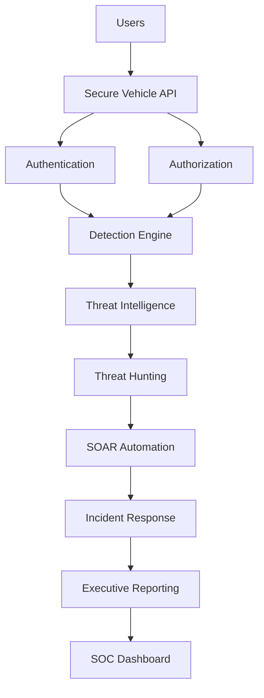
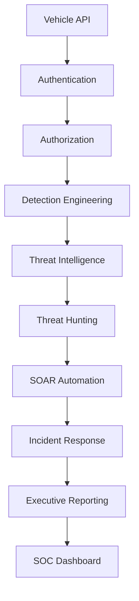

# 🚗 Secure Vehicle API: Zero Trust Security Operations Platform


---

## Executive Summary

Secure Vehicle API: Zero Trust Security Operations Platform is a cybersecurity engineering project that demonstrates the evolution of a vulnerable vehicle control API into a Zero Trust–aligned Security Operations ecosystem.

The project progresses through twenty security phases covering:

- Authentication
- Authorization
- Detection Engineering
- Threat Hunting
- Incident Response
- Threat Intelligence
- SOAR Automation
- Machine Learning Detection
- Cloud Security
- Identity Federation
- Kubernetes Security
- EDR Simulation
- Purple Team Operations
- AI-Assisted SOC Analysis

The vehicle API serves as the attack surface while the Security Operations Center (SOC) components provide visibility, detection, investigation, response, and reporting capabilities.

This repository is intended as a cybersecurity engineering and SOC simulation platform for demonstrating modern defensive security concepts rather than a production vehicle control system.

---

## Architecture

## Documentation

| Document                    | Description                         |
| --------------------------- | ----------------------------------- |
| Security Engineering Report | docs/SECURITY_ENGINEERING_REPORT.md |
| Zero Trust Maturity Matrix  | docs/ZERO_TRUST_MATURITY_MATRIX.md  |
| MITRE ATT&CK Mapping        | docs/MITRE_MAPPING.md               |
| Security Policy             | SECURITY.md                         |
| Project License             | LICENSE                             |




## Architecture




### Security Flow

```text
Vehicle API
    ↓
Authentication
    ↓
Authorization
    ↓
Detection Engineering
    ↓
Threat Intelligence
    ↓
Threat Hunting
    ↓
SOAR Automation
    ↓
Incident Response
    ↓
Executive Reporting
    ↓
SOC Dashboard
```

---

## Key Features

### Zero Trust Security Controls

- API Authentication
- Role-Based Authorization
- Least Privilege Enforcement
- Identity Federation
- Security Policy Validation

### Security Operations

- Detection Engineering
- Threat Hunting
- Incident Response
- SOAR Automation
- Executive Reporting

### Advanced Analytics

- Threat Intelligence Correlation
- Machine Learning Anomaly Detection
- Attack Path Analysis
- Attack Heatmap Generation
- Security Metrics Engine

### Modern Security Platforms

- Cloud Security Simulation
- Kubernetes Security Controls
- Endpoint Detection & Response Simulation
- Purple Team Operations
- AI SOC Analyst

---

## Additional Documentation

- Security Engineering Report: `docs/SECURITY_ENGINEERING_REPORT.md`
- Security Policy: `SECURITY.md`

---

## Phase Progression

| Phase | Capability |
|---------|---------|
| Phase 01 | Vulnerable Vehicle API |
| Phase 02 | Authentication |
| Phase 03 | Authorization |
| Phase 04 | SIEM Detection |
| Phase 05 | Detection Engineering |
| Phase 06 | Threat Hunting |
| Phase 07 | Incident Response |
| Phase 08 | Threat Intelligence |
| Phase 09 | SOAR Automation |
| Phase 10 | Detection Engine |
| Phase 11 | ML Anomaly Detection |
| Phase 12 | Cloud Security |
| Phase 13 | Attack Path Analysis |
| Phase 14 | Attack Heatmap |
| Phase 15 | Executive Reporting |
| Phase 16 | Identity Federation |
| Phase 17 | Kubernetes Security |
| Phase 18 | EDR Simulation |
| Phase 19 | Purple Team Operations |
| Phase 20 | AI SOC Analyst |

---

## Screenshots

# 📸 Security Analytics Intelligence Layer

> **Executive Summary:**  
This section visualizes SOC telemetry, detection engineering outputs, behavioral analytics, and machine learning–driven anomaly detection across the Secure Vehicle API environment.

---

## 🧭 SOC Command Dashboard

<p align="center">
  
</p>

**Key Insights:**
- Unified SOC operational visibility  
- Real-time alert aggregation  
- Multi-layer security monitoring  

---

## 🔥 MITRE ATT&CK Coverage Heatmap

<p align="center">
  
</p>

**Key Insights:**
- Maps detections to adversary techniques  
- Identifies coverage gaps  
- Enables purple team validation  

---

## 📊 API Behavioral Analytics

<p align="center">
  
</p>

**Key Insights:**
- Detects abnormal endpoint usage  
- Establishes baseline traffic behavior  
- Identifies abuse patterns  

---

## 🚗 Identity-Based Access Distribution

<p align="center">
  
</p>

**Key Insights:**
- Tracks identity-level access patterns  
- Supports least privilege validation  
- Detects anomalous identity concentration  

---

## ⚠️ Security Failure & Attack Signals

<p align="center">
  
</p>

**Key Insights:**
- Highlights authentication failures  
- Detects brute-force patterns  
- Supports incident investigation  

---

## 🤖 ML-Based Anomaly Detection Engine

<p align="center">
  
</p>

**Key Insights:**
- Detects statistical outliers  
- Flags behavioral anomalies  
- Enhances SOC triage prioritization  

---

## Installation

```bash
git clone https://github.com/switice/secure-vehicle-api-zero-trust.git

cd secure-vehicle-api-zero-trust

python -m venv venv

source venv/bin/activate

pip install -r requirements.txt
```

---

## Running the Platform

### Detection Engine

```bash
python phase_10_detection_engine.py
```

### SOC Dashboard

```bash
python soc_dashboard.py
```

---

## Running Tests

```bash
pytest
```

Coverage:

```bash
pytest --cov=. --cov-report=term-missing
```

---

## Technologies Used

- Python
- Flask
- Pandas
- Plotly
- Matplotlib
- Scikit-Learn
- REST APIs
- Docker
- GitHub Actions

---

## License

MIT License

---

# 🤝 Project Collaboration

## Chukwuemeke Ikpeasonim

Cybersecurity Engineer | SOC Operations | Detection Engineering | Zero Trust Security

LinkedIn: https://www.linkedin.com/in/chukwuemeke-ikpeasonim

GitHub: https://github.com/switice

---

## Christina James

Cybersecurity Professional | Security Architecture | Identity & Access Management

LinkedIn: https://www.linkedin.com/in/christinanjames

GitHub: https://github.com/phoenyxcipher

---

## Collaboration Acknowledgment

Secure Vehicle API: Zero Trust Security Operations Platform was collaboratively developed by Chukwuemeke Ikpeasonim and Christina James.

The project combines expertise in:

* Zero Trust Architecture
* Identity & Access Management
* Detection Engineering
* Threat Hunting
* Incident Response
* Security Operations
* Security Architecture

The platform demonstrates the evolution of a vulnerable API into a layered security ecosystem featuring authentication, authorization, detection engineering, threat intelligence, SOAR automation, identity federation, cloud security, Kubernetes security, EDR simulation, purple team operations, and AI-assisted SOC analysis.

